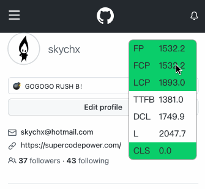

# per-monitor


## Feature



- **tiny**: 2.62 KiB
- **draggable**: support drag and drop
- **mobile first**: first support mobile
- **easy**: dowmload、import、use

<br />

## Web Vitals

### Core Web Vitals

- [Cumulative Layout Shift (CLS)](https://web.dev/cls/)
- [First Input Delay (FID)](https://web.dev/fid/)
- [Largest Contentful Paint (LCP)](https://web.dev/lcp/)


### Other Web Vitals

- [First Paint (FP)](https://developer.mozilla.org/en-US/docs/Glossary/First_paint)
- [First Contentful Paint (FCP)](https://web.dev/fcp/)
- [Time to First Byte (TTFB)](https://web.dev/ttfb/)
- [DOMContentLoaded (DCL)](https://developer.mozilla.org/en-US/docs/Web/API/Window/DOMContentLoaded_event)
- [load (L)](https://developer.mozilla.org/en-US/docs/Web/API/Window/load_event)

<br />

## Install and Use

### Install

```
TODO
```


### Use

```typescript
import 
```


```html
<!DOCTYPE html>
<html>
  <head>
  </head>
  <body>
    ...
    <script>
      // Inline code from `dist/index.js` here
    </script>
  </body>
</html>
```

<br />

## Browser Support

| vitals | Android(Chromium) | iOS(Safari) |
| ------ | ----------------- | ----------- |
| FP     | ✅                 | ❌           |
| FCP    | ✅                 | ✅ (>= 14.5) |
| LCP    | ✅                 | ❌           |
| TTFB   | ✅                 | ✅           |
| DCL    | ✅                 | ✅           |
| L      | ✅                 | ✅           |
| FID    | ✅                 | ❌           |
| CLS    | ✅                 | ❌           |

Safari does not support `first-paint`、`largest-contentful-paint`、`first-input` and `cumulative-layout-shift` Event.

<br />

## LICENSE

[Apache 2.0](/LICENSE)
